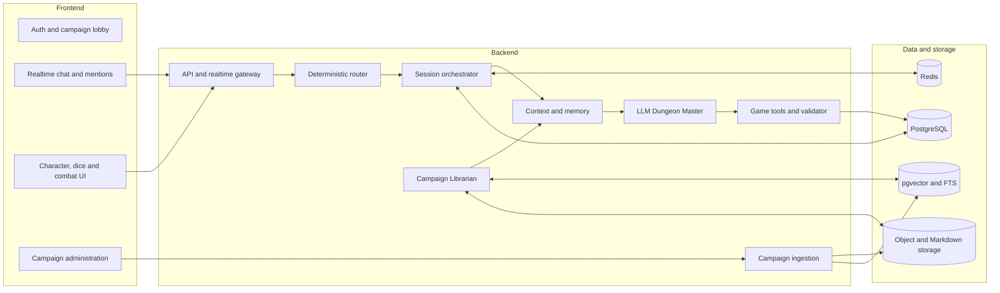
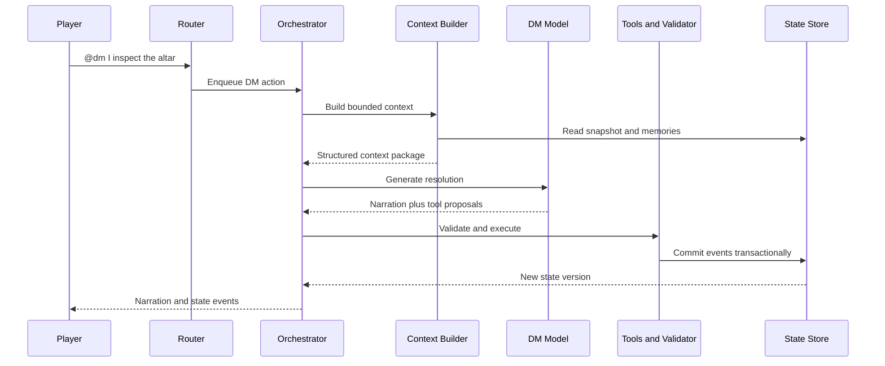

# LLM Dungeon Master Platform — Architecture

**Status:** Draft architecture
**Version:** 0.1
**Last updated:** 2026-09-04

## 1. Purpose

This document defines the technical architecture for a persistent, online, text-based Dungeons & Dragons 5e platform in which an LLM acts as the Dungeon Master.

The system supports:

- Multiple players in a persistent campaign.
- Explicit `@dm`, `@player`, `@party`, `/roll`, `/sheet`, `/ooc`, and `/whisper` routing.
- Player-to-player conversation that does not invoke the DM.
- Deterministic, server-authoritative dice rolls and game-state changes.
- Persistent character sheets, encounters, world state, transcripts, and memories.
- Ingestion and controlled use of authorized campaign books.
- Long-running sessions without placing the complete campaign history into the LLM context.

The accompanying diagram is available as `dnd-llm-system-architecture.svg`.

## 2. Architectural principle

> The LLM plays the Dungeon Master, but it does not own the game state.

The LLM may narrate, adjudicate ambiguous actions, request tools, and propose state changes. Deterministic backend services remain responsible for:

- Message routing.
- Dice randomness.
- Character-sheet calculations.
- Combat sequencing.
- Authorization and visibility.
- Validation and persistence.
- State-version checks.
- Campaign retrieval and spoiler filtering.

This boundary prevents fabricated rolls, accidental DM responses, invalid inventory updates, inconsistent HP, and context-dependent state loss.

## 3. Logical architecture



## 4. Recommended implementation stack

| Layer | Technology | Responsibility |
| --- | --- | --- |
| Web client | React, Vite, TypeScript | Player, DM-host, and campaign administration interfaces |
| Client state | TanStack Query plus a small local state store | Server state, optimistic UI, active-session presentation state |
| Realtime transport | WebSocket or Socket.IO | Ordered chat, presence, rolls, state updates, and streamed narration |
| Backend | NestJS modular monolith | APIs, realtime gateway, routing, orchestration, tools, and persistence |
| AI workflow | LangGraphJS inside the DM module | Bounded LLM/tool workflow; not the authoritative session state machine |
| Primary database | PostgreSQL | Canonical transactional game and account state |
| Vector retrieval | pgvector | Campaign chunks and episodic-memory similarity search |
| Lexical retrieval | PostgreSQL full-text search | Exact names, rules terminology, headings, and source references |
| Ephemeral coordination | Redis | Presence, queues, per-session locks, pub/sub, and short-lived caches |
| Background jobs | BullMQ | Book ingestion, summaries, indexing, and memory extraction |
| File storage | S3-compatible object storage | Uploaded books, normalized Markdown, handouts, images, and exports |
| LLM access | Provider abstraction | Structured tool calling across hosted or local models |
| Telemetry | OpenTelemetry plus Langfuse or Phoenix | Traces, latency, prompt size, retrieval, tool use, and model cost |

Start as a modular monolith. Separate the ingestion workers and AI execution service only when load, security, or deployment requirements justify it.

## 5. Frontend architecture

### 5.1 Application areas

#### Authentication and campaign lobby

- Account creation and sign-in.
- Campaign creation and invitations.
- Player, host, and administrator roles.
- Character selection and session entry.
- Online presence and reconnect status.

#### Realtime game chat

- `@dm` and player mention autocomplete.
- Public table chat, in-character chat, out-of-character chat, and whispers.
- DM narration streaming.
- Roll-request cards with explicit confirmation.
- Message delivery, retry, and sequence status.
- Clear visibility labels for public, private, and hidden events.

The frontend may assist with mention parsing, but the backend must perform authoritative routing.

#### Character, dice, and combat interface

- Character sheet and derived modifiers.
- Skills, saving throws, attacks, spells, inventory, resources, and conditions.
- Server-generated roll results and modifier breakdowns.
- Initiative, current turn, combat round, HP, temporary HP, and pending actions.
- Read-only state while a conflicting mutation is being committed.

#### Campaign administration

- Campaign-book upload.
- Ingestion progress and extraction errors.
- Review of chapters, locations, NPCs, encounters, and cross-references.
- House rules and selected 5e ruleset version.
- Spoiler scope and campaign-progression controls.
- Handout release and source corrections.

### 5.2 Client communication

Use REST or GraphQL for non-realtime account, campaign, and administration operations. Use WebSocket events for session activity.

Every client command carries:

- `command_id` for idempotency.
- `session_id`.
- `sender_id` derived from authentication.
- The most recent client-visible `state_version`.
- A typed payload.

The client treats backend events as authoritative and reconciles optimistic presentation state when confirmation arrives.

## 6. Backend architecture

### 6.1 API and realtime gateway

Responsibilities:

- Authenticate connections and refresh authorization.
- Enforce campaign and character access.
- Accept typed commands.
- Rate-limit abusive clients.
- Assign or validate idempotency keys.
- Broadcast ordered events.
- Resume a session from a known sequence number after reconnect.

### 6.2 Deterministic message router

The router determines whether a message invokes the DM without using an LLM.

| Input | Route | Invoke DM |
| --- | --- | ---: |
| `@dm I inspect the altar` | DM action queue | Yes |
| `@Aria Do you have the key?` | Named player | No |
| `@party We should retreat` | Party channel | No |
| Untagged message | Table chat | No |
| `/roll perception` | Dice service | No, unless it completes a pending DM request |
| `/sheet equip longsword` | Character-sheet service | No |
| `/ooc We should stop at ten` | Out-of-character channel | No |
| `/whisper @Aria ...` | Private channel | No |

Public player dialogue may be recorded as observable scene dialogue without triggering inference. Private messages are excluded from DM context unless campaign settings explicitly allow DM visibility.

### 6.3 Session orchestrator

The orchestrator is a deterministic application state machine. Suggested states are:

- `WAITING_FOR_PLAYERS`
- `DM_GENERATING`
- `WAITING_FOR_ROLL`
- `WAITING_FOR_TARGET`
- `WAITING_FOR_MULTIPLE_PLAYERS`
- `COMBAT_TURN`
- `RESOLVING_ACTION`
- `PAUSED`
- `SESSION_ENDED`

Each campaign session has an ordered command queue and monotonically increasing state version. The orchestrator:

1. Loads the current snapshot.
2. Validates the triggering event.
3. Builds the context request.
4. Runs the bounded DM workflow.
5. Executes requested tools.
6. Validates proposed mutations.
7. Commits events transactionally.
8. Publishes narration and state changes.

Only one state-mutating resolution runs for a session at a time. Player chat may continue concurrently because it does not mutate game state or invoke the DM.

### 6.4 LLM Dungeon Master workflow

The DM receives a structured context package and must return schema-valid output:

```json
{
  "narration": "The lock gives a faint metallic click.",
  "addressed_to": ["party"],
  "tool_requests": [],
  "proposed_state_changes": [
    {
      "operation": "mark_door_unlocked",
      "target_id": "door.crypt_west"
    }
  ],
  "memory_candidates": [
    {
      "fact": "The party unlocked the western crypt door.",
      "importance": 0.55
    }
  ],
  "next_state": "WAITING_FOR_PLAYERS"
}
```

The backend validates this response before any side effect. Narration and mutations are committed as one logical resolution so that a response cannot describe an action the backend rejected.

### 6.5 Game tools and validator

The tool layer owns deterministic mechanics:

- Dice and random tables.
- Ability checks and saving throws.
- Attack and damage resolution.
- Initiative and combat turns.
- HP, temporary HP, resistance, immunity, and conditions.
- Spell slots, ammunition, charges, hit dice, and rest resources.
- Inventory and equipment.
- Rules lookup.
- Time advancement.
- Quest, NPC, location, clue, and world-state transitions.

Each mutation includes an actor, permission scope, source event, expected state version, and idempotency key.

### 6.6 Dice service

Dice are rolled by the backend using a cryptographically secure random-number generator. Store:

- Dice expression.
- Individual die results.
- Modifier values and their character-sheet sources.
- Advantage or disadvantage.
- Total.
- Visibility.
- Requester and authorized roller.
- Associated encounter or pending check.
- State version and timestamp.

Arbitrary player rolls do not automatically trigger DM generation. Completion of an authorized, pending DM roll may enqueue resolution.

### 6.7 Campaign ingestion worker

The asynchronous ingestion pipeline:

1. Accepts an authorized PDF, EPUB, HTML, or Markdown source.
2. Extracts text, headings, tables, boxed text, images, and page references.
3. Applies OCR where required.
4. Reconstructs the document hierarchy.
5. Classifies chapters, locations, rooms, encounters, NPCs, items, clues, and read-aloud text.
6. Extracts entities and cross-references.
7. Generates normalized Markdown with YAML frontmatter.
8. Produces hierarchical chunks.
9. Builds lexical, vector, and entity indexes.
10. Places uncertain or conflicting extraction results into a human review queue.

Uploaded campaign material is untrusted data and must never override system or tool instructions.

### 6.8 Campaign Librarian

The Librarian is a read-oriented file-exploration agent. It may:

- List campaign files.
- Search text and metadata.
- Open a section or bounded line range.
- Resolve an entity or alias.
- Follow cross-references.
- Retrieve the current location or encounter.
- Return a cited, token-bounded source packet.

It may not narrate, roll dice, modify character sheets, advance quests, or commit state.

Routine retrieval should use direct search tools. Invoke the full Librarian workflow for cross-chapter questions, new-scene preparation, ambiguous references, or multi-source lore synthesis.

## 7. Data architecture

### 7.1 PostgreSQL

PostgreSQL is the canonical state store. Core records include:

- Users, campaigns, memberships, roles, and invitations.
- Sessions, scenes, messages, recipients, and visibility.
- Characters, features, resources, inventory, spells, and conditions.
- Encounters, combatants, initiative, turns, and pending actions.
- Rolls and modifier provenance.
- NPCs, locations, quests, clues, factions, and world facts.
- Immutable state events and materialized snapshots.
- Memories, summaries, and source-event provenance.
- Campaign sources, chunks, entities, and ingestion status.

Use relational columns for identity, ownership, ordering, and query-critical fields. Use JSONB for edition-specific or campaign-specific payloads.

### 7.2 Event log and snapshots

Every authoritative change is recorded as an append-only event. Examples include:

- `CHARACTER_DAMAGED`
- `SPELL_SLOT_CONSUMED`
- `ITEM_ACQUIRED`
- `DOOR_UNLOCKED`
- `NPC_DISPOSITION_CHANGED`
- `QUEST_STAGE_ADVANCED`
- `ROLL_COMPLETED`

Snapshots provide fast reads. Events provide audit, replay, restoration, debugging, and summary provenance.

### 7.3 Vector and lexical indexes

Use hybrid retrieval:

- Metadata filters establish campaign, ruleset, chapter, spoiler scope, location, and entity boundaries.
- Full-text search resolves exact names, headings, rules terms, and identifiers.
- Vector similarity resolves semantic questions and paraphrases.
- Reranking may be introduced after measuring retrieval quality.

Hard metadata filters must execute before semantic ranking to prevent cross-campaign and future-chapter leakage.

### 7.4 Object and Markdown storage

Store:

- Original uploaded books.
- Normalized campaign Markdown.
- Source-page maps.
- Images and player handouts.
- Import reports.
- Transcript and recap exports.

Mutable game state remains in PostgreSQL. Generated Markdown recaps are projections and can be regenerated from events.

### 7.5 Redis

Redis stores only recoverable, ephemeral data:

- WebSocket presence.
- Per-session execution locks.
- Queued background jobs.
- Pub/sub events.
- Short-lived retrieval and authorization caches.

Redis is not the source of truth for game state.

## 8. Context and memory management

### 8.1 Context layers

Every DM invocation is assembled from controlled layers:

1. Stable DM contract, tool schemas, ruleset, and safety settings.
2. Current structured scene and game-state snapshot.
3. Complete unresolved action thread.
4. Bounded recent public conversation.
5. Retrieved episodic memories.
6. Spoiler-filtered campaign and rules source packets.
7. Current tool results and pending decision.

The complete transcript and campaign book are never sent by default.

### 8.2 Example budget for a 128k model

| Component | Maximum tokens |
| --- | ---: |
| System contract and schemas | 6,000 |
| Current structured state | 8,000 |
| Recent transcript and unresolved action | 12,000 |
| Campaign retrieval | 12,000 |
| Rules retrieval | 6,000 |
| Episodic memory | 6,000 |
| Tool results | 4,000 |
| Output and tool-call reserve | 16,000 |

These are ceilings, not targets. Normal turns should use substantially less.

### 8.3 Memory tiers

- **Working memory:** Current action, scene, and recent conversation.
- **Episodic memory:** Important past events retrieved by entity, quest, recency, and similarity.
- **Semantic world memory:** Canonical facts about NPCs, locations, factions, and relationships.
- **Rolling summaries:** Scene, session, character, NPC relationship, and unresolved-thread summaries.
- **Archive:** Complete immutable transcript and event history, queried only when necessary.

Summaries are navigation aids rather than authoritative truth. Every durable memory retains provenance to source event IDs.

### 8.4 Scene consolidation

When a scene closes:

1. Create a scene recap.
2. Extract durable facts and unresolved threads.
3. Update entity-centric memory records.
4. Preserve the complete source events and messages.
5. Remove the full scene transcript from default context.

Memory candidates are generated asynchronously and validated for provenance, contradiction, and durability before becoming canonical.

## 9. Campaign Markdown format

Normalized campaign files use YAML frontmatter:

```markdown
---
id: location.cragmaw_hideout
type: location
campaign: lost-mine
chapter: 1
source:
  book: lost-mine-of-phandelver
  pages: [7, 8, 9]
spoiler_level: dm
unlock_condition: quest.find_gundren.started
entities:
  - npc.klarg
  - npc.yeemik
connections:
  - location.triboar_trail
---

# Cragmaw Hideout

## Overview
## Approaches and entrances
## Areas
## NPC knowledge
## Encounters
## Discoverable clues
## Read-aloud text
## DM-only information
## Cross-references
```

Live state is overlaid on source content. If a published room says a door is locked but the event log records that players unlocked it, live state wins.

## 10. Core runtime flows

### 10.1 DM-addressed action



### 10.2 Player-to-player chat

1. Gateway authenticates the sender.
2. Router resolves the player, party, or table recipient.
3. Message is stored with visibility metadata.
4. Gateway broadcasts it to authorized recipients.
5. No DM inference is scheduled.

### 10.3 DM-requested roll

1. DM proposes a typed check request.
2. Tool service validates character, ability, modifier, visibility, and allowed roller.
3. The frontend displays the pending request.
4. Player confirms the roll.
5. Dice service generates and stores the result.
6. Completion event resumes the waiting DM resolution.
7. Outcome and mutations are validated and committed.

### 10.4 Campaign ingestion

1. Administrator uploads an authorized campaign source.
2. Ingestion workers parse, OCR, normalize, classify, and index it.
3. Human review resolves low-confidence structures or conflicts.
4. Approved content becomes available to the Librarian.
5. Retrieval applies campaign, progression, location, and spoiler filters.

## 11. Security and trust boundaries

- Authenticate every REST and WebSocket request.
- Recheck campaign membership server-side.
- Use explicit recipient and visibility fields for all messages and rolls.
- Encrypt secrets and private content at rest and in transit.
- Treat books, Markdown, player input, and retrieved text as untrusted data.
- Separate instructions from retrieved content in model prompts.
- Allow only schema-defined tool calls.
- Validate tool arguments against permissions and current state.
- Apply rate limits to messages, uploads, rolls, and model invocations.
- Scan uploads and enforce file type and size limits.
- Do not distribute campaign-book content without appropriate rights.
- Retain auditable records for hidden rolls and administrator overrides.

## 12. Reliability and observability

Track:

- WebSocket connection and reconnect success.
- Command queue depth and per-session lock time.
- End-to-end DM turn latency.
- LLM time-to-first-token and generation duration.
- Prompt and completion tokens.
- Context contribution by layer.
- Retrieval hits, source coverage, and spoiler-filter exclusions.
- Tool success, validation rejection, and retry rates.
- State-version conflicts.
- Summary and memory extraction failures.
- Cost per session and per campaign.

Every trace should correlate `campaign_id`, `session_id`, `command_id`, `resolution_id`, `state_version`, model request, tool calls, and committed events without exposing private content in ordinary logs.

## 13. Deployment topology

### Initial deployment

- One frontend deployment.
- One or more stateless NestJS application instances.
- Shared PostgreSQL, Redis, and object storage.
- Separate BullMQ worker processes.
- Hosted or local LLM provider behind the provider abstraction.

Use sticky sessions only if required by the WebSocket library. Prefer a shared pub/sub adapter so any application instance can publish session events.

### Scaling boundaries

Scale independently when justified:

- Realtime gateway.
- DM inference workers.
- Campaign ingestion workers.
- Retrieval service.
- Summary and memory workers.

Partition execution by `session_id` to preserve ordering. Partition campaign sources by `campaign_id` to preserve retrieval isolation.

## 14. Key architectural decisions

1. PostgreSQL, not the LLM or Redis, owns canonical state.
2. Message addressing is parsed deterministically.
3. Untagged and player-addressed chat does not invoke the DM.
4. Dice and mechanical state changes execute through backend tools.
5. The session orchestrator is deterministic; LangGraph is bounded inside the AI workflow.
6. Campaign books are normalized into human-readable Markdown plus structured indexes.
7. A read-oriented Librarian explores campaign files and returns bounded source packets.
8. Context is assembled per turn under explicit token budgets.
9. Events are immutable; snapshots and Markdown recaps are derived projections.
10. The architecture begins as a modular monolith and separates services only when operational evidence demands it.
